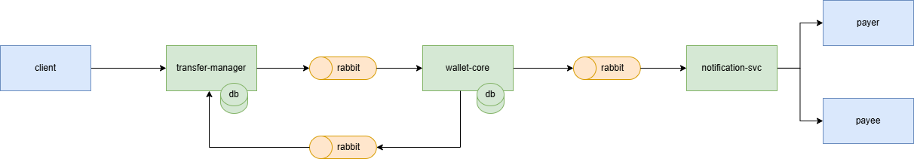

# 🚀 PayFlow - Sistema de Pagamentos Distribuído

[](https://www.java.com/)
[](https://spring.io/projects/spring-boot)
[](https://www.rabbitmq.com/)
[](https://www.docker.com/)

**PayFlow** é um ecossistema de microserviços focado no processamento resiliente de transferências financeiras. Este projeto simula uma arquitetura de pagamentos instantâneos, demonstrando conceitos avançados de arquitetura de software, consistência eventual e sistemas distribuídos.

---

## 🏗 Arquitetura do Sistema

O sistema foi desenhado seguindo o padrão **Event-Driven Architecture (EDA)**. Os serviços são desacoplados e comunicam-se de forma assíncrona para processamento transacional.

### 🧩 Os Microserviços

| Serviço | Diretório | Porta | Responsabilidade |
| :--- | :--- | :--- | :--- |
| **Transfer Manager** | `/transfer-manager` | `8081` | **Gateway de Entrada**. Recebe a intenção de transferência, valida dados básicos e orquestra o evento inicial. |
| **Wallet Core** | `/wallet-core` | `8080` | **Ledger Financeiro**. Gerencia usuários, carteiras e saldos. Executa a movimentação financeira com ACID e consistência. |
| **Notification Svc** | `/notification-svc` | `8083` | **Worker**. Consome eventos de sucesso para notificar os usuários (simulação de e-mail). |

### 🔄 Fluxo da Informação



---

## 🛠 Tecnologias e Padrões
- Linguagem: Java 21
- Framework: Spring Boot 4 
- Comunicação Assíncrona: RabbitMQ
- Comunicação Síncrona: REST (Spring Web) e OpenFeign
- Banco de Dados: PostgreSQL e MongoDB
- Infraestrutura: Docker Compose.

---

## ⚡ Como Rodar o Projeto
A maneira mais simples de executar o ecossistema completo é utilizando o Docker Compose.

**Pré-requisitos**

- Docker e Docker Compose instalados.
- Java 21 (JDK) instalado (para buildar os .jar).

**Passo a Passo**
1. Clone o repositório:
```Bash
git clone [https://github.com/lucasmoraist/payflow.git](https://github.com/lucasmoraist/payflow.git)
cd payflow
```
2. Certifique-se de que cada microserviço esteja atualizado com o comando:
````bash
git submodule update --init --remote <nome-do-microserviço>
````
3. Dentro de `k8s/applications.yml` adicione um valor para ``JSM_EMAIL`` e ``JSM_PASSWORD`` 
   com um email e senha para envio de email com Java Mail Sender

4. Execute os serviços via script (com base no seu sistema operacional):
```Bash
# No Linux/Mac
exec-services-linux.sh

# No Windows
exec-services-win.bat
```

5. Acesse o dashboard do Minikube
```Bash
minikube dashboard
```

---

## 🧪 Como Testar (Guia Rápido)
Como os bancos de dados iniciam vazios, você precisará popular os dados antes de transferir.

1. Criar Usuários (Wallet Core)
   
Crie o **Pagador** (quem envia o dinheiro):

- **POST** ``http://localhost:8080/api/v1/users``
- **Body**:
```JSON
{
    "fullName": "Anakin Skywalker",
    "cpfCnpj": "11122233344",
    "email": "ani@tatooine.com",
    "password": "password123"
}
```
**(Anote o id retornado no header).**

Crie o **Beneficiário** (quem recebe):

- **POST** ``http://localhost:8080/api/v1/users``
- **Body**:
```JSON
{
    "fullName": "Obi-Wan Kenobi",
    "cpfCnpj": "22233344455",
    "email": "ben@jedi.com",
    "password": "password123"
}
```
**(Anote o id retornado no header).**

2. Adicionar Saldo (Opcional)

Ao criar o usuário, a carteira inicia com saldo 0. Você pode manipular o banco ou usar um endpoint de depósito.

3. Realizar Transferência (Transfer Manager)

Agora, chame o orquestrador para iniciar o processo.

- **POST** ``http://localhost:8081/api/v1/transfer``
- **Body**:
```JSON
{
    "payer": "ID_DO_ANAKIN",
    "payee": "ID_DO_OBI_WAN",
    "value": 50.00
}
```
4. Validar Resultados
   
1. Acesse o RabbitMQ Management: ``http://localhost:15672`` (guest/guest). 
2. Observe as filas wallet.processing e notification.send-email movimentando mensagens. 
3. Verifique os logs do container notification-svc:

```Bash
docker logs payflow-notification-svc-1
```

## 📂 Estrutura de Diretórios
````
payflow/
├── compose.yml              # Orquestração local dos containers
├── transfer-manager/        # Microserviço de entrada (API Gateway logic)
├── wallet-core/             # Microserviço de contas e saldo
└── notification-svc/        # Microserviço consumidor de notificações
````

## 🛡️ Melhorias Futuras (Roadmap)
- [ ] Implementação de Autenticação (OAuth2/Keycloak).
- [ ] Adicionar Rate Limiting no Transfer Manager.
- [ ] Painel de Observabilidade (Grafana + Prometheus).
- [ ] Testes de Carga com K6 para validar a performance das filas.

**Desenvolvido por Lucas Morais 🚀**
